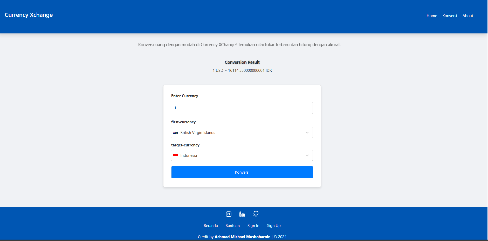

# Forex Currency Converter

## Deskripsi Singkat
Aplikasi Forex Currency Converter adalah aplikasi frontend yang dibuat menggunakan framework React.js. Aplikasi ini memungkinkan pengguna untuk mendapatkan informasi forex berdasarkan mata uang atau negara, serta melakukan kalkulasi konversi mata uang. Antarmuka aplikasi didesain agar sederhana, responsif, dan user-friendly.

## Fitur
- Input untuk mata uang (currency) atau kalkulator.
- Input untuk negara (country).
- Tombol pencarian.
- Area hasil pencarian.
- Kalkulator forex:
  - Input mata uang asal dan tujuan.
  - Input jumlah yang akan dikonversi.
  - Tombol konversi.
  - Area hasil konversi.

## Cara Menjalankan Aplikasi Secara Lokal

### Prasyarat
- Node.js dan npm sudah terinstall di sistem Anda.

### Langkah-langkah
1. Clone repositori ini:
   ```sh
   git clone https://github.com/achmichael/test-frontend-intern.git
   ```
2. Masuk Ke Direktori Proyek Yang sudah Di Clone:
   ```
   cd test-frontend-intern
   ```
3. Install Dependensi

   ```
    npm install
   ```
4. Jalankan Aplikasi

   ```
   npm run dev
   ```

Aplikasi akan berjalan di `http://localhost:3000`.





`URL DEPLOY`

https://currency-xchange.vercel.app